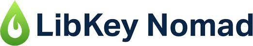
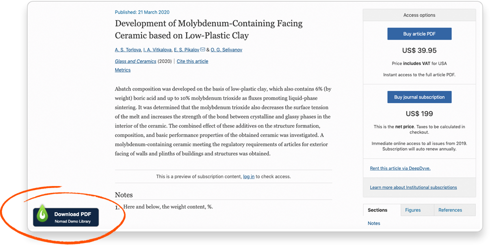

We’re excited to share a new tool you can use to streamline your access to online Library resources:

Our new LibKey Nomad tool gives you one-click access to the Library’s millions of online resources, whether you’re accessing them from the Library’s website or the open web, through sites like Google Scholar. In addition, LibKey Nomad will quickly and reliably connect you to millions of Open Access resources.

LibKey Nomad is a safe and easy to install browser extension that works with Google Chrome, Firefox, and Microsoft Edge.

Once installed, LibKey Nomad will alert you whenever a resource is available online through the Library or Open Access sources. LibKey works with many major academic publisher’s websites, including Wiley, Elsevier (ScienceDirect), SAGE, and Taylor & Francis:

When you click on the LibKey Nomad icon in the lower left corner of your browser, you’ll be taken directly to the full text of the article. If the full text isn’t available, you’ll be forwarded to the Library’s catalog, where you can submit an interlibrary loan request for the article.

In addition, LibKey Nomad works with many other sites that link to online scholarship, including PubMed, Wikipedia, and Google Scholar.

LibKey Nomad is part of the Library’s effort to streamline access to the many high-value scholarly resources we make available to Concordia students, faculty, and staff. 

You can download LibKey Nomad here.

Reach out to us at [library@csp.edu](mailto:library@csp.edu) or via [chat](https://library.csp.edu/chat) if you have any questions or need any assistance setting up LibKey Nomad.